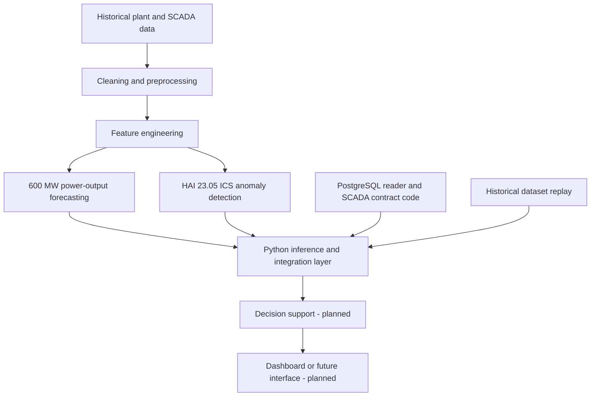

# AI-Based Load Estimation and Predictive Outage Analysis Integrated with SCADA in Smart Power Systems

## 1. Project Overview

This repository develops data-driven analytics for thermal-power-plant SCADA and operational data. Its implemented model work covers 600 MW plant power-output forecasting and HAI 23.05 industrial control system (ICS) anomaly detection.

The 600 MW forecasts provide a power-output estimate for the project's load-estimation component. The HAI pipeline detects anomalies against labeled ICS data. Python integration code connects these analytics to SCADA-shaped records, historical replay, and a PostgreSQL reader/contract layer. These capabilities support future operator decision support; they do not establish a live plant deployment.

The project title describes the wider motivation. The current models do not directly forecast electrical-grid demand or predict physical grid outages.

## 2. Current Project Status

### Completed and frozen

- Leakage-reviewed 600 MW power-output forecasting models for 2-, 10-, and 30-minute horizons.
- HAI 23.05 temporal feature pipeline and frozen Candidate C Isolation Forest detector.
- Candidate C batch and streaming inference engines with schema and behavior validators.
- Established dataset cleaning, feature preparation, and validation workflows.

### Current integration work

- Python runtime and SCADA record-contract modules are present under `scripts/integration/`.
- A PostgreSQL reader and adapter to the SCADA contract are implemented in the repository.
- Dataset replay and local integration-validation scripts are present.
- The repository contains no evidence of an active connection to physical plant SCADA or a deployed production service. PostgreSQL code is not evidence that live inference-result storage is operating.

### Planned

FastAPI serving, an MQTT replay publisher, persistent live/inference storage, a decision-support engine, and a React dashboard remain roadmap work.

## 3. System Architecture



The PostgreSQL and replay paths describe repository code. They do not imply a live SCADA connection. FastAPI, MQTT publishing, persistent inference storage, decision support, and the dashboard are future components.

## 4. 600 MW Forecasting Pipeline

The source is the one-week 600 MW unit operating workbook at `data/raw/600mw/600 MW unit one-week operating data.xlsx`. It contains 5,674 source rows and 78 columns: time plus 77 numeric SCADA/process variables. The recorded interval is two minutes. After target alignment and removal of boundary rows, the full engineered dataset contains 5,649 valid rows.

The forecasting targets are future plant power output at:

- 2 minutes
- 10 minutes
- 30 minutes

The pipeline includes leakage review and temporal robustness validation. The frozen models use leakage-safe Feature Set D with 119 engineered features. Their target is plant power output; they serve the load-estimation component and are not direct grid-demand forecasts.

The primary frozen artifacts are stored under `models/forecasting/600mw/`:

- `600mw_2min_final.joblib`
- `600mw_10min_final.joblib`
- `600mw_30min_final.joblib`
- `600mw_forecasting_model_metadata.json`
- `600mw_forecasting_feature_manifest.json`

The model metadata records Linear Regression models trained on the 5,649 valid rows.

## 5. HAI 23.05 Anomaly Detection Pipeline

HAI 23.05 is an ICS dataset sampled at one-second intervals. The repository includes training segments `hai-train1.csv` through `hai-train4.csv`, test segments `hai-test1.csv` and `hai-test2.csv`, and aligned test labels.

The dataset has 86 original SCADA variables. The model-ready representation retains 58 selected original features. The temporal reference representation has 232 numeric features. Candidate C selects 118 features: 58 original features, 30 absolute-difference features, and 30 rolling-standard-deviation features.

Candidate C uses a frozen Isolation Forest model at:

`data/features/hai/hai-23.05/temporal_representation/final_candidate/hai_2305_candidate_C_isolation_forest.joblib`

The Candidate C production inference components include the manifest-driven engine in `scripts/inspection/hai_23_05/25_inference/candidate_C_inference_engine.py` and the streaming engine beside it. Candidate C uses about 49.1% fewer features than the 232-feature temporal reference.

HAI labels describe ICS security anomalies/attacks in this dataset. They must not be interpreted automatically as physical equipment failures or electrical outages.

## 6. Temporal Feature Engineering

The HAI temporal pipeline starts from the 58 selected original variables and creates:

- `diff_1s`: signed one-second change
- `abs_diff_1s`: absolute one-second change
- `rolling_std_5s`: five-second rolling variability

Together with the original variables, these produce the 232-feature temporal reference. Candidate C retains the original, absolute-difference, and rolling-standard-deviation families for its selected features; it does not include the signed `diff_1s` family.

Feature selection is based on training data. At the beginning of a sequence, the inference engines mark rows without enough history as `INSUFFICIENT_HISTORY`; those rows are not treated as normal or anomalous predictions.

## 7. Candidate C Evaluation

The following are the established evaluation results for the frozen Candidate C detector:

| Evaluation split | Precision | Recall | F1 |
|---|---:|---:|---:|
| Test 1 | 0.301837 | 0.192888 | 0.235366 |
| Test 2 | 0.138890 | 0.338689 | 0.196996 |

These are results on the repository's HAI evaluation splits. They are not claims of general real-world performance.

## 8. Repository Structure

```text
config/                         Project path configuration
data/
  raw/                          Source workbooks and HAI files
  processed/                    Cleaned datasets
  features/                     Model-ready and temporal features
  integration/                  Replay and integration artifacts
  validation/                   Validation outputs
  dataset_registry/             Dataset registry outputs
models/
  forecasting/600mw/            Frozen 600 MW models and manifests
scripts/
  cleaning/
  dataset_creation/
  experiments/
  inference/
  inspection/
  integration/
  modeling/
  performance/
  processing/
  validation/
README.md
requirements.txt
```

Dataset files are stored under `data/`. The current `.gitignore` excludes generated/processed `data/*` content while explicitly allowing `data/raw/**`; raw source files are currently tracked in this repository. Avoid adding large derived outputs to Git.

## 9. Important Scripts

- `scripts/cleaning/`: source-dataset cleaning, including `clean_600mw.py` and `clean_hai.py`.
- `scripts/dataset_creation/600mw/`: target and lag creation, leakage/redundancy analysis, and `validate_forecasting_datasets.py`.
- `scripts/processing/create_dataset_registry.py`: dataset and artifact registry generation.
- `scripts/modeling/`: leakage-safe validation, temporal robustness validation, and `freeze_600mw_models.py`.
- `scripts/inference/forecasting_600mw.py`: 600 MW forecast inference.
- `scripts/inference/hai_candidate_C_inference.py`: HAI Candidate C inference wrapper.
- `scripts/inspection/hai_23_05/22_temporal_representation/` and `23_temporal_evaluation/`: HAI temporal features and candidate evaluation.
- `scripts/inspection/hai_23_05/24_final_detector/` and `25_inference/`: Candidate C artifacts, engines, and validators.
- `scripts/integration/`: AI runtime, SCADA contract/schema, PostgreSQL reader/bridge, replay, and integration validation.
- `scripts/validation/`: 600 MW forecast analysis and report generation.
- `scripts/experiments/`: optional experiments; CUDA/RAPIDS imports here are not core pipeline dependencies.

## 10. Frozen / Protected Components

The following components are frozen or established and should not be retrained, replaced, or restructured without deliberate validation:

- HAI Candidate C Isolation Forest and its 118-feature manifest.
- The three 600 MW forecasting models and their 119-feature schema.
- Established cleaning and feature-engineering pipelines.
- The inference engines, output schemas, and current integration behavior.

Use their existing validators when making a planned change. The optional `scripts/performance/benchmark_600mw_runtime.py` imports PyTorch; it is not needed by the core pipeline and is not included in `requirements.txt`.

## 11. Current Roadmap

1. Path/configuration cleanup — **COMPLETE**
2. `requirements.txt` and README — **CURRENT**
3. FastAPI model-serving layer — **PLANNED**
4. Dataset-replay MQTT publisher — **PLANNED**
5. PostgreSQL live/inference storage — **PLANNED** (a PostgreSQL reader/contract adapter already exists)
6. Decision Support Engine — **PLANNED**
7. React dashboard — **PLANNED**
8. Final documentation/architecture update — **PLANNED**

## 12. Installation

The repository has no formal Python-version metadata. The current project workspace uses Python 3.11.0; use Python 3.11 for a matching setup.

```powershell
python -m venv .venv
.venv/Scripts/Activate.ps1
python -m pip install --upgrade pip
python -m pip install -r requirements.txt
```

On macOS or Linux, activate the environment with:

```bash
source .venv/bin/activate
```

Useful existing validation commands include:

```bash
python scripts/integration/audit_hardcoded_paths.py
python scripts/dataset_creation/600mw/validate_forecasting_datasets.py
python scripts/inspection/hai_23_05/25_inference/validate_candidate_C_engine_schema.py
python scripts/inspection/hai_23_05/25_inference/validate_candidate_C_inference_engine.py
python scripts/integration/validate_ai_runtime.py
```

These commands expect the relevant local datasets and model artifacts. Some validation and replay scripts write outputs beneath `data/`. PostgreSQL checks also require a separately configured, reachable PostgreSQL database. The repository does not currently import FastAPI, Uvicorn, or an MQTT client; those belong to planned roadmap components.

## 13. Reproducibility / Validation

- Keep training, validation, and test roles separate.
- HAI feature selection is based on training data; test labels are for post-hoc evaluation.
- The 600 MW pipeline reviews leakage and includes chronological/temporal robustness validation.
- Frozen model artifacts and their feature manifests define the deployed inference schemas.
- Use the repository's validation scripts after deliberate pipeline changes.
- Scripts now derive project paths from their file locations, so their operation does not depend on the shell's current directory.

## 14. Limitations

- The demonstrated analytics operate on historical datasets and local replay. No physical plant SCADA deployment is established by this repository.
- The 600 MW models forecast plant power output, not grid demand.
- The HAI detector classifies dataset ICS anomalies; it does not directly predict physical equipment failures or electrical outages.
- Repository PostgreSQL reader/contract code does not establish a deployed live-ingestion or inference-storage service.
- Evaluation results are specific to the included datasets and splits and should not be generalized to real-world plant performance without further validation.
